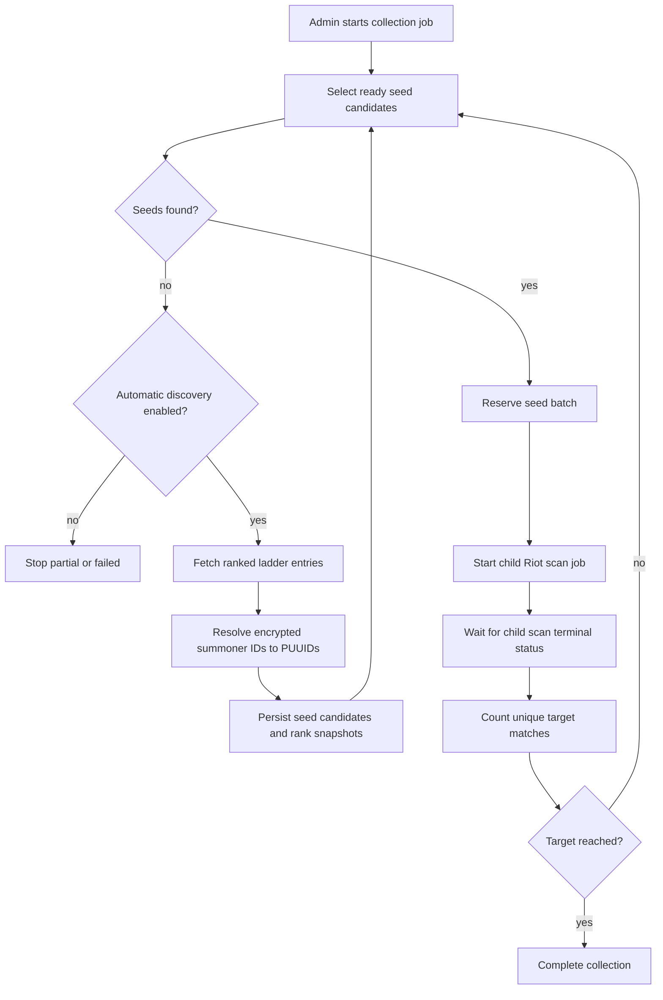

# Counter Pick Automated Collection

Issue 249 adds a rank-first collection layer above the existing Riot match scanner. The collection job is the durable parent record; the existing scan job remains the child worker that fetches match history, persists matchup observations, and updates counter pick stats.

## Scope

The first version is deliberately controlled:

- EUW only (`EUW1` platform, `EUROPE` regional route).
- Ranked Solo/Duo only.
- Rank brackets: Iron-Silver, Gold-Emerald, Diamond, and Master+.
- Target sizes: 50, 100, or 200 unique matches.
- One child scan batch runs at a time.
- Child batches use at most 20 seed PUUIDs.
- Ladder discovery is optional and stops at the configured safety limits.

This gives the admin UI a safe way to collect enough data for Counter Pick testing without manually starting many independent scans.

## Data Model

`riot_collection_jobs` stores the parent job:

- requested bracket, role, champion focus, target match count, and region
- lifecycle status and stop reason
- aggregate progress counters
- child-scan progress JSON
- safety and diagnostic counters

`riot_scan_jobs.collection_job_id` links child scans back to a parent collection job.

`riot_collection_job_seeds` records every seed candidate reserved for the parent job. This prevents the same seed from being reused inside one collection run.

`riot_collection_job_matches` records unique match IDs counted toward the parent job target. The uniqueness key is `(collection_job_id, match_id, role)`, so repeated observations from later child scans do not inflate progress.

`riot_ladder_discovery_cursors` stores Riot ladder pagination state per platform, queue, tier, and division. This lets future jobs continue from the next page instead of repeatedly reading the same ladder page.

`riot_summoner_puuid_cache` stores encrypted summoner ID to PUUID lookups from Riot's Summoner API. Ladder endpoints return encrypted summoner IDs, while the existing scanner needs PUUIDs.

## Flow

## Rank Brackets

The admin selects a LaneStomp bracket. Collection discovery maps that bracket to Riot ladder sources:

- `iron-silver`: Iron, Bronze, Silver, divisions I-IV
- `gold-emerald`: Gold, Platinum, Emerald, divisions I-IV
- `diamond`: Diamond, divisions I-IV
- `master-plus`: Master, Grandmaster, Challenger

Ready seeds are selected from existing `riot_seed_candidates` first. The sorter prefers:

1. matching champion focus when one is set
2. matching role when a role is set
3. higher observed seed history
4. stronger previous scan yield
5. older successful scans

## Discovery

When no ready seed candidates remain and automatic discovery is enabled, the job reads Riot ranked ladder sources for the selected bracket. Standard tiers use paged `/league/v4/entries` calls. Master+ uses the high-tier league endpoints.

Each ladder entry is normalized with the same rank metadata shape used by seed rank enrichment. The job then:

- resolves encrypted summoner IDs into PUUIDs
- caches successful and failed lookups
- upserts the PUUID into `riot_seed_candidates`
- writes a `riot_seed_candidate_rank_snapshots` row for ranked entries
- marks the imported seed with enough observation signal to be eligible for the next scan batch

The last point is a V1 bridge. Ladder entries are rank-qualified, but they do not yet have organic LaneStomp seed observation history. Giving them the minimum scan eligibility signal lets the collector start testing them immediately while still preserving the existing seed lifecycle.

## Progress And Dedupe

Child scans continue to own match fetching and counter pick stat persistence. The parent collection job only reconciles completed child scans.

During reconciliation, the parent reads `riot_matchup_observations` created by the child scan, filters by selected role and optional champion focus, and upserts the match IDs into `riot_collection_job_matches`. The collection target is based on the unique rows in that table, not on the raw number of observations in the child scan summary.

## Safety Limits

The shared defaults are:

- 20 seeds per child scan batch
- 5 ladder pages per parent job advance
- 500 ladder entries inspected
- 100 new candidates imported
- 150 encrypted ID lookups

The job pauses on Riot rate limits and can be resumed later from the admin UI. It completes partially when it has useful data but cannot continue because discovery is disabled, discovery is exhausted, or a child aggregation step fails after some progress.

## Admin Controls

The admin panel can:

- preview ready seed inventory for a bracket, role, and optional champion focus
- start a collection job
- poll and advance active jobs
- pause, resume, or cancel a job
- show recent collection jobs and parent progress counters

Resume advances one safe step at a time: reconcile finished child scans, select seeds, discover seeds if needed, or start the next child scan.

## Deferred Work

This first version does not include unattended scheduled background execution, multi-region collection, parallel child scans, or deep match-yield forecasting. Those are intentionally left out until the basic rank-first collection loop has been tested with live Riot data.
