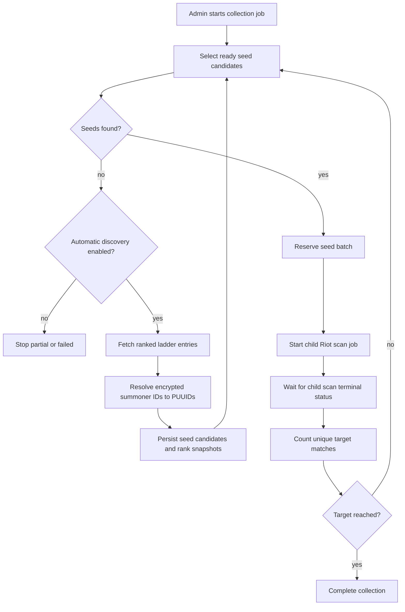

# Counter Pick Automated Collection

Issue 249 adds a rank-first collection layer above the existing Riot match scanner. The collection job is the durable parent record; the existing scan job remains the child worker that fetches match history, persists matchup observations, and updates counter pick stats.

## Scope

The first version is deliberately controlled:

- EUW only (`EUW1` platform, `EUROPE` regional route).
- Ranked Solo/Duo only.
- Rank brackets: Iron-Silver, Gold-Emerald, Diamond, and Master+.
- Target sizes: 50, 100, or 200 unique matches.
- One child scan batch runs at a time.
- Child batches use at most 20 seed PUUIDs and shrink when the remaining target is small.
- Ladder discovery is optional and stops at the configured safety limits.

This gives the admin UI a safe way to collect enough data for Counter Pick testing without manually starting many independent scans.

## Data Model

`riot_collection_jobs` stores the parent job:

- requested bracket, role, champion focus, target match count, and region
- lifecycle status and stop reason
- aggregate progress counters
- child-scan progress JSON
- safety and diagnostic counters

`riot_scan_jobs.collection_job_id` links child scans back to a parent collection job.

`riot_collection_job_seeds` records every seed candidate reserved for the parent job. This prevents the same seed from being reused inside one collection run.

`riot_collection_job_matches` records unique match IDs counted toward the parent job target. The uniqueness key is `(collection_job_id, match_id, role)`, so repeated observations from later child scans do not inflate progress.

`riot_ladder_discovery_cursors` stores Riot ladder pagination state per platform, queue, tier, and division. This lets future jobs continue from the next page instead of repeatedly reading the same ladder page.

`riot_summoner_puuid_cache` stores encrypted summoner ID to PUUID lookups from Riot's Summoner API. Ladder endpoints return encrypted summoner IDs, while the existing scanner needs PUUIDs.

## Flow

## Rank Brackets

The admin selects a LaneStomp bracket. Collection discovery maps that bracket to Riot ladder sources:

- `iron-silver`: Iron, Bronze, Silver, divisions I-IV
- `gold-emerald`: Gold, Platinum, Emerald, divisions I-IV
- `diamond`: Diamond, divisions I-IV
- `master-plus`: Master, Grandmaster, Challenger

Ready seeds are selected from existing `riot_seed_candidates` first. The sorter prefers:

1. matching champion focus when one is set
2. matching role when a role is set
3. higher observed seed history
4. stronger previous scan yield
5. older successful scans

## Discovery

When no ready seed candidates remain and automatic discovery is enabled, the job reads Riot ranked ladder sources for the selected bracket. Standard tiers use paged `/league/v4/entries` calls. Master+ uses the high-tier league endpoints.

Each ladder entry is normalized with the same rank metadata shape used by seed rank enrichment. The job then:

- uses a direct `puuid` from the ladder entry when Riot returns one
- resolves encrypted summoner IDs into PUUIDs only when the entry does not already include PUUID
- caches successful and failed lookups
- upserts the PUUID into `riot_seed_candidates`
- writes a `riot_seed_candidate_rank_snapshots` row for ranked entries
- marks the imported seed with enough observation signal to be eligible for the next scan batch

The last point is a V1 bridge. Ladder entries are rank-qualified, but they do not yet have organic LaneStomp seed observation history. Giving them the minimum scan eligibility signal lets the collector start testing them immediately while still preserving the existing seed lifecycle.

## Runtime Progress And Controls

Child scans continue to own match fetching and counter pick stat persistence. The parent collection job only reconciles completed child scans.

While a child scan is running, the scanner writes live progress to `riot_scan_jobs.progress` and mirrors the same snapshot into `riot_collection_jobs.progress.activeScanProgress`. The admin panel polls with `getRiotCollectionJob`; normal dashboard refreshes only read state, but a guarded recovery path can reconcile a terminal child when the parent is visibly stalled. The explicit Resume button remains the normal UI action that advances a paused or waiting parent job.

The live child progress includes:

- current stage (`initializing`, `fetching-match-ids`, `fetching-matches`, `persisting`, or `scan-complete`)
- seed index while match IDs are being fetched
- fetched and unique match ID counts
- match index and total while matches are being fetched
- last progress timestamp

Pause and Cancel are cooperative controls. The parent status is persisted first, then the running child checks that control state before each Riot request. Cancel stops the child scan as `cancelled`; Pause stops the current child as a controlled cancelled child while leaving the parent job paused. Resuming the parent starts from the persisted parent state and reserved seed history instead of reusing already reserved seeds.

V1 persistence checkpointing is intentionally conservative: progress checkpoints are written throughout the child scan, but matchup observation persistence still happens during the child scan finalization step. If a scan is stopped before finalization, the UI keeps the last live checkpoint and the parent resumes with a fresh child batch. Per-match observation persistence is deferred because it needs a larger aggregation refactor to avoid rebuilding stats from partial duplicate batches.

## Child Reconciliation

The parent collection state is advanced by one shared reconciler in the Counter Pick admin actions. The root cause of the issue 255 stall was that child scans could finish and persist their own observations, while the parent stayed in `scanning` because reconciliation only happened from the explicit collection orchestrator path. Passive polling correctly read state, but it did not consume the terminal child result.

Completed child scans are now consumed through `reconcileCompletedCollectionChild`. The reconciler:

- records collection-valid match identities in `riot_collection_job_matches`
- claims `riot_scan_jobs.collection_result_consumed_at` with a guarded `consumed_at is null` update
- recomputes parent totals from consumed child summaries and durable collection match rows
- clears the active child progress from the parent
- leaves paused parents paused after consuming completed work
- lets the normal orchestrator continue to the target check, next seed batch, discovery, or partial completion

The durable consumption marker makes repeated recovery safe. If two requests see the same terminal child, both can idempotently upsert collection match rows, but only one request claims the child as newly consumed. Parent progress is recomputed from durable data instead of incremented from in-memory state, so retries do not double-count child summaries.

`getRiotCollectionJob` includes a guarded stalled-state check for active parents. It only invokes orchestration when it detects a recoverable mismatch such as:

- `active-parent-no-child`
- `child-missing`
- `child-parent-mismatch`
- `terminal-child-unconsumed`
- `terminal-child-consumed-parent-not-advanced`

Cancelled parents are not resurrected. Paused parents may consume a completed child result, but they do not start another child batch until Resume is pressed.

## Dedupe

During reconciliation, the parent reads `riot_matchup_observations` created by the child scan, filters by selected role and optional champion focus, and upserts the match IDs into `riot_collection_job_matches`. The collection target is based on the unique rows in that table, not on the raw number of observations in the child scan summary.

## Discovery Diagnostics

The parent job persists discovery diagnostics in `riot_collection_jobs.summary.discovery` and displays them in the admin job card. These diagnostics separate each stage:

- sources attempted
- ladder pages fetched
- ladder entries returned
- direct PUUIDs found
- Summoner-V4 lookup attempts
- PUUIDs resolved
- existing candidates reused
- new candidates created
- rank snapshots stored
- lifecycle outcomes
- eligible seeds produced
- API and identifier failures

The primary `seeds_discovered` counter represents eligible seeds produced for the next scan, not merely ladder rows fetched or candidate rows upserted. When discovery stops without selecting another batch, `stop_detail` records the precise cause, such as no ladder entries, failed identifier resolution, no persisted candidates, no eligible lifecycle outcomes, or rate limiting.

## Safety Limits

The shared defaults are:

- up to 20 seeds per child scan batch
- 5 ladder pages per parent job advance
- 500 ladder entries inspected
- 100 new candidates imported
- 150 encrypted ID lookups

The seed batch size adapts to the remaining target and observed yield. New jobs assume roughly four unique target matches per seed until the parent has enough completed child batches to estimate actual yield.

The job pauses on Riot rate limits and can be resumed later from the admin UI. It completes partially when it has useful data but cannot continue because discovery is disabled, discovery is exhausted, or a child aggregation step fails after some progress.

## Admin Controls

The admin panel can:

- preview ready seed inventory for a bracket, role, and optional champion focus
- start a collection job
- poll active jobs without advancing them
- pause, resume, or cancel a job
- show recent collection jobs and parent progress counters

Resume advances one safe step at a time: reconcile finished child scans, select seeds, discover seeds if needed, or start the next child scan.

## Deferred Work

This first version does not include unattended scheduled background execution, multi-region collection, parallel child scans, or deep match-yield forecasting. Those are intentionally left out until the basic rank-first collection loop has been tested with live Riot data.
