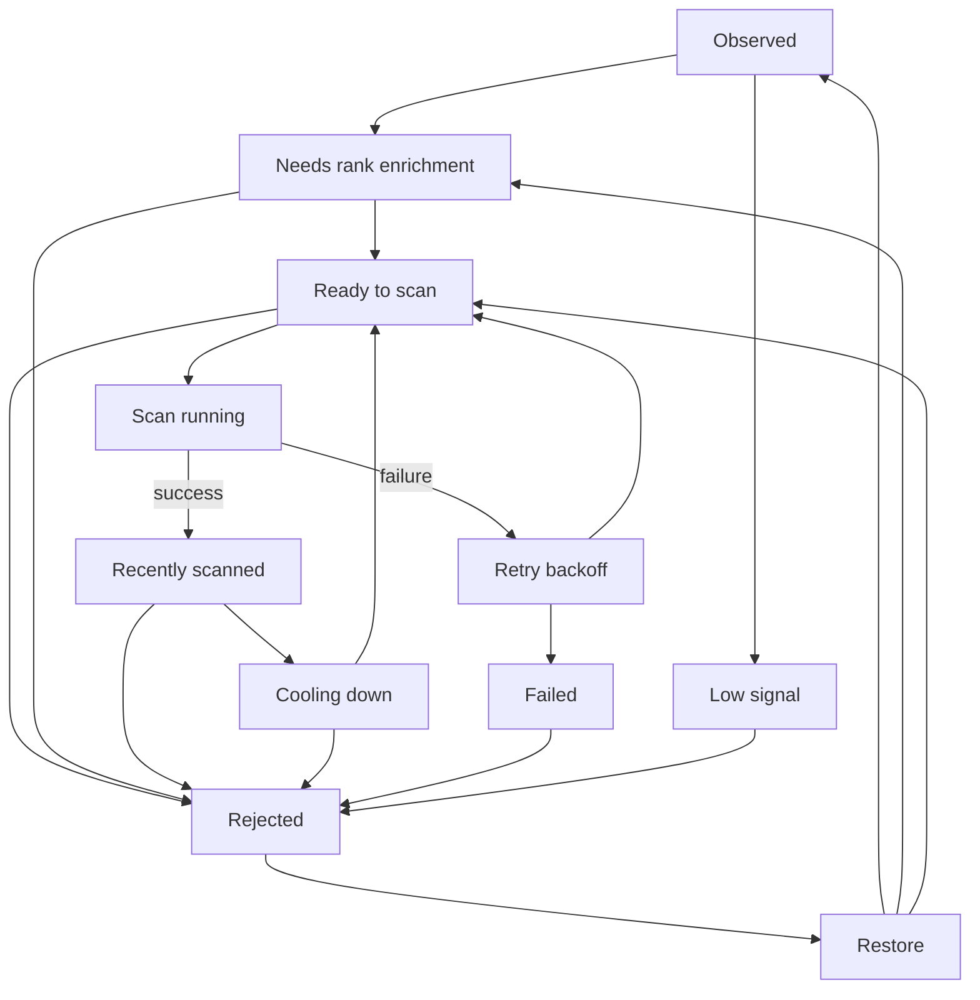

# Counter Pick Seed Pool Lifecycle

Issue: https://github.com/SteinGansmoe/lanestomp/issues/247

This document describes the controlled seed-pool lifecycle used by Counter Pick data collection. It covers seed candidates only. It does not change public Counter Pick aggregation, win-rate math, confidence thresholds, or public `rank_bracket = all` behavior.

## Lifecycle States

Every candidate receives one derived lifecycle state from `deriveSeedCandidateLifecycle` in `src/features/league/riot-seed-candidate-lifecycle.ts`.

Priority order:

1. `rejected`
2. `failed`
3. `low-signal`
4. `recently-scanned`
5. `cooling-down`
6. `needs-rank-enrichment`
7. `ready-to-scan`
8. `observed`

States:

| State                   | Meaning                                                                                                          | Selectable                                                |
| ----------------------- | ---------------------------------------------------------------------------------------------------------------- | --------------------------------------------------------- |
| `observed`              | Candidate exists and has enough observations to inspect, but has not been fully evaluated yet.                   | No                                                        |
| `needs-rank-enrichment` | Candidate needs rank data, has stale rank data, or the latest rank refresh failed.                               | No                                                        |
| `ready-to-scan`         | Candidate has enough observations, a usable rank, no active cooldown/backoff, and no blocking failure/rejection. | Yes, unless the scan-job status is already queued/running |
| `recently-scanned`      | Candidate had a successful scan inside the recent window.                                                        | No                                                        |
| `cooling-down`          | Candidate has a successful scan but is not yet eligible for another scan.                                        | No                                                        |
| `failed`                | Candidate is in scan failure/backoff or exceeded the consecutive failure threshold.                              | No                                                        |
| `low-signal`            | Candidate is stored for history/deduplication, but does not meet minimum signal requirements.                    | No                                                        |
| `rejected`              | Candidate was manually removed from the operational queue.                                                       | No                                                        |

Reason codes are stable strings intended for admin UI tooltips and tests:

- `missing-rank`
- `stale-rank`
- `scan-running`
- `recently-scanned`
- `cooldown-active`
- `too-few-observations`
- `manual-rejection`
- `consecutive-failures`
- `retry-backoff`
- `rank-refresh-failed`
- `unsupported-rank-bracket`
- `ready`

## Lifecycle Diagram

The actual implementation keeps scan-job lifecycle (`queued`, `running`, `completed`, `failed`) separate from seed lifecycle. A queued/running seed receives reason code `scan-running` and is not selectable, but scan-job status remains the source of truth for the job itself.

## Rank Brackets

Seed rank tabs use these brackets:

- `iron-silver`: Iron, Bronze, Silver
- `gold-emerald`: Gold, Platinum, Emerald
- `diamond`: Diamond
- `master-plus`: Master, Grandmaster, Challenger
- `unknown`: missing, unranked, failed, pending, or unsupported rank state

The public Counter Pick rank groups are separate. Seed rank enrichment determines whether a candidate is useful as a future scan seed. Matchup rank attribution updates already stored matchup observations and rebuilds affected `counter_pick_stats` rank groups.

## Readiness Rules

Named constants live in `src/features/league/riot-seed-candidate-lifecycle.ts`:

- `MIN_SEED_OBSERVATIONS = 2`
- `DEFAULT_SEED_SCAN_COOLDOWN_DAYS = 7`
- `RECENTLY_SCANNED_WINDOW_HOURS = 48`
- `MAX_CONSECUTIVE_SCAN_FAILURES = 3`
- `RANK_SNAPSHOT_STALE_DAYS = 30`

A candidate is ready when:

- it is not manually rejected
- it has at least 2 observations
- it has a usable ranked solo/duo rank snapshot
- its rank snapshot is not stale
- it is not queued/running in a scan
- it is not inside the recent window
- its cooldown has expired
- its retry backoff has expired
- it is below the consecutive failure threshold

Unknown rank candidates are visible in the Unknown tab, but are not scan-selectable for rank-targeted collection.

## Cooldown And Failure Behavior

When a selected seed scan succeeds:

- `last_scanned_at = now`
- `last_successful_scan_at = now`
- `latest_scan_job_id = scan job id`
- `next_eligible_scan_at = now + 7 days`
- `next_retry_at = null`
- `consecutive_scan_failures = 0`
- latest scan-yield fields are copied from the scan job summary

When a selected seed scan fails:

- `last_scanned_at = now`
- `latest_scan_job_id = scan job id`
- `last_scan_error_code` is set to a concise internal code
- `last_scan_error_at = now`
- `consecutive_scan_failures += 1`
- `failed_scan_count += 1`
- `next_retry_at` is calculated from backoff

Initial retry backoff:

- first failure: 1 hour
- second failure: 6 hours
- third and later failures: 24 hours

At `MAX_CONSECUTIVE_SCAN_FAILURES`, the candidate stays in `failed` until an admin resets failure state.

## Stored Versus Derived Fields

Stored/reused:

- `observed_games`
- `rank_enrichment_status`
- `rank_tier`
- `rank_division`
- `rank_last_success_at`
- `rank_next_eligible_at`
- `last_scanned_at`
- `next_eligible_scan_at`
- `times_scanned`
- `successful_scan_count`
- `failed_scan_count`
- `consecutive_scan_failures`
- `status`

Stored by this lifecycle task:

- `last_successful_scan_at`
- `latest_scan_job_id`
- `last_scan_error_code`
- `last_scan_error_at`
- `next_retry_at`
- `manually_rejected_at`
- `manually_rejected_by`
- `rejection_reason`
- `last_scan_match_ids_fetched`
- `last_scan_unique_matches_found`
- `last_scan_duplicate_matches_skipped`
- `last_scan_matchup_observations_inserted`
- `last_scan_candidate_observations_discovered`

Derived:

- lifecycle state
- lifecycle reason codes
- rank bracket
- scan selectability
- display `nextEligibleAt`

Intentionally deferred:

- separate per-seed scan result history table
- automatic multi-job scan orchestration
- dynamic cooldown configuration
- Riot ladder import automation
- coverage targets like 200 unique games

## Migration And Backfill

Migration `20260617190000_add_seed_candidate_lifecycle_fields.sql` is additive and idempotent:

- adds the durable lifecycle support fields
- backfills `last_successful_scan_at` from existing successful candidates where possible
- backfills `next_eligible_scan_at` as `last_successful_scan_at + 7 days` when missing
- adds indexes for common lifecycle filters
- does not delete candidates, observations, rank snapshots, or stats
- does not reset existing valid scan timestamps

Rollback guidance:

- dropping the new columns removes lifecycle operations added by this task
- existing `riot_seed_candidate_observations`, `riot_seed_candidate_rank_snapshots`, `riot_matchup_observations`, and `counter_pick_stats` data remains intact

## Admin UI Behavior

The seed candidate panel is organized by rank tab:

- Master+
- Diamond
- Gold-Emerald
- Iron-Silver
- Unknown

Inside each rank tab, lifecycle filters are available:

- Ready to scan
- Recently scanned
- Cooling down
- Needs rank enrichment
- Failed
- Low signal
- Observed
- Rejected
- All

Default operational view:

- Rank tab: Master+
- Lifecycle: Ready to scan

Rows show:

- shortened PUUID identifier
- lifecycle status and reasons
- rank
- primary role
- primary champion
- observed games
- last scan timing
- next eligible timing
- latest scan yield
- duplicate rate

Only candidates whose lifecycle returns `isSelectableForScan = true` can be selected for a normal scan. Disabled rows expose the reason in their checkbox tooltip and remain inspectable.

Bulk actions:

- refresh rank
- add selected ready candidates to scanner
- scan selected ready candidates
- reject selected
- restore rejected
- reset failed

Pagination, rank filtering, lifecycle filtering, and sorting are performed by the server query path. The UI does not fetch every candidate into the browser.

## Relationship To Matchup Rank Coverage

Seed rank enrichment:

- belongs to `riot_seed_candidates`
- determines whether a player can become a useful future scan seed
- powers seed lifecycle readiness

Matchup rank attribution:

- belongs to `riot_matchup_observations`
- updates already stored matchup rows
- rebuilds affected `counter_pick_stats` rank groups

These flows may link to each other in admin workflow, but they remain separate responsibilities.

## Known Limitations

- Latest scan-yield fields are copied from the job summary to each selected seed. This is operationally useful, but it is not yet true per-seed yield attribution.
- Lifecycle counts are server-side and filter-aware, but they are calculated from current durable fields rather than a materialized `lifecycle_status` column.
- Search currently covers PUUID and primary champion identifier. Riot ID display can be added later if Riot ID identity is stored durably.
- Dynamic cooldown and automated collection are deferred to Task 3.

## Task 3 Preparation

This lifecycle creates the controlled inventory Task 3 needs:

- choose rank bracket
- filter to ready candidates
- avoid recently scanned/cooling candidates
- avoid failed/rejected/low-signal candidates
- respect the 20-seed scan limit
- keep rank enrichment separate from matchup rank attribution
- preserve existing public aggregation behavior
